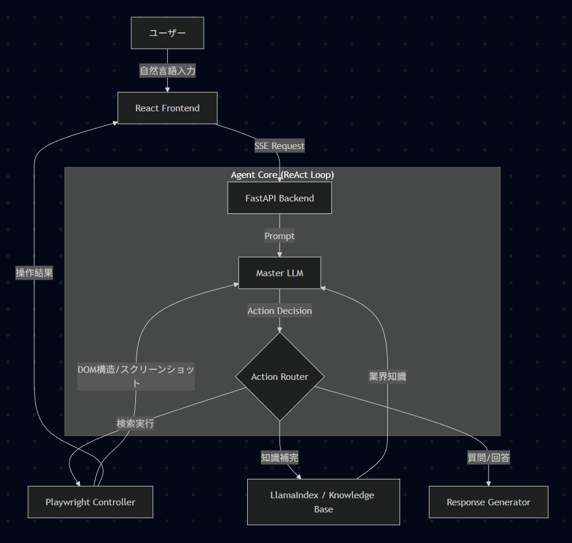

<div align="center">

[**🇯🇵 日本語 (Japanese)**](#jp) | [**🇺🇸 English**](#en)

</div>

---

<div id="jp"></div>

# 対話型・企業データベース検索AI (Agentic RAG / Playwright)

## 概要
**「広東省にある、資本金1億以上の自動車ガラスメーカーを探したい」**

営業担当者が入力するこのような抽象的な自然言語の要望を解析し、複雑な企業データベースサイト（SaaS/検索ポータル）の「詳細検索フォーム」へ自動的に条件をマッピング・入力・実行する自律型AIエージェントです。

従来のルールベースのRPAとは異なり、LLM（大規模言語モデル）を用いたAgentic RAG（自律的検索拡張生成）アーキテクチャを採用することで、未知の検索条件や揺らぎのある表現にも柔軟に対応します。

## 主な機能と特徴

### 1. 自律的な意思決定 (ReAct Agent Pattern)
バックエンド（`backend_app.py`）では、ユーザーの入力をそのまま検索に使うのではなく、エージェントが「思考・行動・観察」のループを実行します。
*   **思考**: ユーザーの要望に対し、情報が不足していないか判断。
*   **行動**: 知識不足なら「社内ナレッジベース(RAG)」を検索、情報が揃えば「ブラウザ操作ツール」を実行、不明点があれば「ユーザーに逆質問」を行います。

### 2. 高度なDOM解析とコスト削減 (LLM x Playwright)
Webページ全体を単純にLLMに渡すのではなく、Playwrightを用いてDOM構造を解析し、**「意味のある選択肢（チェックボックスやドロップダウン）」のみを抽出して軽量なJSON形式**でLLMに提示します（`playwright_test.py`）。
*   **効果**: 画像認識や全文解析に比べ、**トークン消費量を約90%削減**しつつ、推論精度を向上させました。
*   **複雑なUI対応**: 深い階層構造を持つ「業界分類ツリー」も、DFS（深さ優先探索）アルゴリズムで自動展開し、最適なカテゴリを特定します。

### 3. リアルタイム・ストリーミングUI
ReactフロントエンドとFastAPIバックエンドをSSE (Server-Sent Events) で接続。
*   AIの「思考プロセス（Thinking...）」
*   ブラウザ操作の「リアルタイムスクリーンショット」
*   操作完了後の「実行レポート」
をチャット形式で可視化し、ユーザーに安心感を与えるUXを実現しました。

## 技術スタック

| カテゴリ | 技術・ツール | 用途 |
| --- | --- | --- |
| **Frontend** | React, CSS (Custom) | チャットUI、ログ可視化、SSE受信 |
| **Backend** | Python, FastAPI | 非同期APIサーバー、エージェント制御 |
| **LLM / AI** | OpenAI SDK (ModelScope/Qwen), Gemini API | 推論、コード生成、JSON解析 |
| **RAG** | LlamaIndex, HuggingFace Embeddings | 業界知識（サプライチェーン等）の検索 |
| **Automation** | Playwright (Async API) | ヘッドレスブラウザ操作、DOM解析 |
| **Infra/Others** | SSE (Server-Sent Events) | ストリーミング通信 |

## アーキテクチャ図



## プロジェクト構造 (主要ファイル抜粋)

```text
.
├── backend_app.py       # FastAPIアプリケーションエントリポイント (ReAct Agent実装)
├── playwright_test.py   # ブラウザ操作ロジック (LLM x Playwright連携)
├── rag_utils.py         # LlamaIndexを用いたナレッジベース検索ロジック
├── requirements.txt     # バックエンド用依存ライブラリ
├── knowledge_docs/      # RAG用の業界知識ドキュメント格納フォルダ
└── frontend/            # フロントエンドプロジェクト
    └── src/
        ├── App.jsx      # メインのチャットUIとログ表示コンポーネント
        ├── App.css      # チャット画面のスタイリング
        ├── main.jsx     # Reactのエントリポイント
        └── assets/      # 静的リソースフォルダ
```

## 工夫した点（技術的ハイライト）

### 排他制御と論理的推論の組み合わせ
業界分類ツリーの選択において、「親カテゴリ」と「子カテゴリ」が同時に選択された場合、より具体的な「子カテゴリ」を優先して親の選択を解除する**排他制御ロジック**をPython側で実装し、検索ノイズを減らしました。

### エラーハンドリングと自己修復
LLMが生成するJSON形式が崩れていた場合、正規表現を用いて自動修復するロジック（`extract_json_from_text`）を実装し、システムの実用的な安定性を高めています。

### ハイブリッドLLM構成
推論コストと精度のバランスを取るため、メインの推論には「Gemini Flash」、サブタスクやバックアップには「Qwen (ModelScope)」を切り替えて使用できる設計にしています。


## セットアップと実行

本プロジェクトは、Backend（Python/FastAPI）とFrontend（React）を別々のターミナルで起動して連携させます。

### 1. 環境構築 (初回のみ)

プロジェクトのルートディレクトリで以下のコマンドを実行し、仮想環境を作成・有効化した後、依存ライブラリをインストールします。

**Windows (PowerShell)**
```powershell
# 仮想環境の作成
python -m venv venv

# 仮想環境の有効化
.\venv\Scripts\Activate.ps1

# バックエンド依存ライブラリのインストール
pip install -r requirements.txt

# Playwright用ブラウザバイナリのダウンロード（必須）
playwright install
```

### 2. Backend の起動

仮想環境が有効な状態で、以下のコマンドを実行してAPIサーバーを立ち上げます。

```powershell
# 仮想環境が未有効の場合は先に実行: .\venv\Scripts\Activate.ps1

# ローカル開発用（自分だけがアクセスする場合）
uvicorn backend_app:app --reload --port 8000

# 【オプション】同一LAN内のスマホ等からアクセスする場合
# uvicorn backend_app:app --reload --host 0.0.0.0 --port 8000
```
*   起動成功後、コンソールに `Uvicorn running on ...` と表示されます。

### 3. Frontend の起動

別のターミナルを開き、フロントエンドディレクトリへ移動して起動します。

```powershell
cd frontend

# 初回のみ依存パッケージをインストール
npm install

# 開発サーバーを起動
npm run dev
```
*   ブラウザで `http://localhost:5173`（または表示されたURL）にアクセスしてチャット画面を開きます。
*   バックエンドをLAN公開モード（`0.0.0.0`）で起動した場合、スマホからは `http://[PCのIPアドレス]:5173` でアクセスしてください（※Viteの設定で `--host` が必要な場合があります）。


## 今後の展望 (Future Improvements)

現在のプロトタイプは単一サーバー（Monolithic）構成で動作していますが、本番環境での大規模並列利用を見据え、以下のアーキテクチャ刷新と機能拡張を計画しています。

### 1. アーキテクチャの非同期マイクロサービス化 (Scalability)
現在の構成ではAPIサーバーとブラウザ実行プロセスが同居しているため、多重アクセス時にリソース枯渇（OOM）のリスクがあります。これを解決するため、**Producer-Consumerパターン**への移行を予定しています。
*   **API Gateway / Reasoning Agent**: LLM推論とタスク生成のみを担当する軽量コンテナ。
*   **Task Queue (Redis)**: 実行ジョブをバッファリングし、流量制御を行う。
*   **Browser Workers**: Playwrightを実行する独立したコンテナ群。負荷に応じて水平スケール（Horizontal Scaling）可能にする。

### 2. ブラウザ実行環境のリモート化 (Remote Browser Isolation)
アプリケーションサーバーのリソース負荷を最小化するため、ローカルでのブラウザ起動を廃止し、**CDP (Chrome DevTools Protocol)** を介して外部のブラウザクラスター（例: Browserless, Selenium Grid）に接続する構成へ変更します。これにより、実行環境のサンドボックス化と安定性を向上させます。

### 3. セッション管理の永続化と分析 (Observability)
現在はオンメモリで管理しているチャットセッションや実行ログを、**Redis** や **PostgreSQL** に永続化します。これにより、サーバー再起動後もコンテキストを維持できるようにすると同時に、ユーザーがどのような検索キーワードで失敗したかを分析し、RAGの検索精度向上に役立てます。

### 4. Human-in-the-loop (HITL) の強化
エージェントが生成した検索条件に対し、実行前にユーザーが修正・承認できるインタラクションフローを追加します。ユーザーの修正操作をフィードバックデータとして蓄積し、次回の推論精度を向上させる仕組みを構築します。

---

<div id="en"></div>

# Interactive Corporate DB Search AI (Agentic RAG / Playwright)

## Overview
**"I want to find auto glass manufacturers in Guangdong province with a capital of over 100 million."**

This is an autonomous AI agent designed to parse such abstract natural language requests from sales representatives. It automatically maps, inputs, and executes search conditions on complex corporate database websites (SaaS/Search Portals) through their "Advanced Search" forms.

Unlike traditional rule-based RPA, this system adopts an **Agentic RAG (Retrieval-Augmented Generation)** architecture powered by LLMs. This allows it to flexibly handle unknown search criteria and ambiguous expressions.

## Key Features

### 1. Autonomous Decision Making (ReAct Agent Pattern)
The backend (`backend_app.py`) doesn't just feed user input directly into a search. Instead, the agent executes a "Thought-Act-Observe" loop.
*   **Thought**: Analyzes the user's request to determine if there is sufficient information.
*   **Act**: If knowledge is lacking, it searches the "Internal Knowledge Base (RAG)". If information is sufficient, it executes the "Browser Automation Tool". If there are ambiguities, it "Asks the User for clarification".

### 2. Advanced DOM Parsing & Cost Reduction (LLM x Playwright)
Instead of passing the entire web page HTML to the LLM, the system uses Playwright to parse the DOM structure. It **extracts only meaningful elements (checkboxes, dropdowns) into a lightweight JSON format** for the LLM to process (`playwright_test.py`).
*   **Effect**: Reduces **token consumption by approximately 90%** compared to image recognition or full-text parsing, while improving inference accuracy.
*   **Complex UI Handling**: Supports complex structures like "Industry Classification Trees" by automatically expanding them using a DFS (Depth-First Search) algorithm to identify the optimal categories.

### 3. Real-time Streaming UI
The React frontend and FastAPI backend are connected via SSE (Server-Sent Events).
*   AI's "Thinking Process"
*   Real-time "Screenshots" of browser operations
*   Post-execution "Result Reports"
These are visualized in a chat format, providing a transparent and reassuring UX for the user.

## Tech Stack

| Category | Technology/Tool | Usage |
| --- | --- | --- |
| **Frontend** | React, CSS (Custom) | Chat UI, Log Visualization, SSE Receiver |
| **Backend** | Python, FastAPI | Async API Server, Agent Control |
| **LLM / AI** | OpenAI SDK (ModelScope/Qwen), Gemini API | Inference, Code Generation, JSON Parsing |
| **RAG** | LlamaIndex, HuggingFace Embeddings | Searching Industry Knowledge (Supply Chains, etc.) |
| **Automation** | Playwright (Async API) | Headless Browser Control, DOM Parsing |
| **Infra/Others** | SSE (Server-Sent Events) | Streaming Communication |

## Architecture Diagram


## Project Structure (Key Files)

```text
.
├── backend_app.py       # FastAPI Entry Point (ReAct Agent Implementation)
├── playwright_test.py   # Browser Logic (LLM x Playwright Integration)
├── rag_utils.py         # Knowledge Base Search Logic using LlamaIndex
├── requirements.txt     # Backend Dependencies
├── knowledge_docs/      # Document Folder for RAG (Industry Knowledge)
└── frontend/            # Frontend Project
    └── src/
        ├── App.jsx      # Main Chat UI & Log Component
        ├── App.css      # Chat Styling
        ├── main.jsx     # React Entry Point
        └── assets/      # Static Resources
```

## Technical Highlights

### Logic for Mutual Exclusion & Reasoning
When selecting from the industry classification tree, if both a "Parent Category" and a "Child Category" are selected simultaneously, I implemented a **mutual exclusion logic** in Python to prioritize the more specific "Child Category" and deselect the parent. This reduces search noise.

### Error Handling & Self-Correction
To handle cases where the LLM generates broken JSON, I implemented a self-correction logic (`extract_json_from_text`) using regular expressions to repair the output, significantly improving system stability.

### Hybrid LLM Configuration
To balance inference cost and accuracy, the system is designed to switch between models: "Gemini Flash" for main inference tasks and "Qwen (ModelScope)" for sub-tasks or as a backup.

## Setup & Execution

This project requires running the Backend (Python/FastAPI) and Frontend (React) in separate terminals.

### 1. Environment Setup (First Time Only)

Run the following commands in the project root directory to create/activate a virtual environment and install dependencies.

**Windows (PowerShell)**
```powershell
# Create Virtual Environment
python -m venv venv

# Activate Virtual Environment
.\venv\Scripts\Activate.ps1

# Install Backend Dependencies
pip install -r requirements.txt

# Download Playwright Browser Binaries (Required)
playwright install
```

### 2. Start Backend

With the virtual environment activated, run the following command to start the API server.

```powershell
# Ensure venv is activated: .\venv\Scripts\Activate.ps1

# For Local Development (Access only from your machine)
uvicorn backend_app:app --reload --port 8000

# [Option] To allow access from other devices (e.g., Mobile) on the same LAN
# uvicorn backend_app:app --reload --host 0.0.0.0 --port 8000
```
*   Upon success, `Uvicorn running on ...` will appear in the console.

### 3. Start Frontend

Open a new terminal, navigate to the frontend directory, and start the application.

```powershell
cd frontend

# Install Dependencies (First Time Only)
npm install

# Start Development Server
npm run dev
```
*   Open `http://localhost:5173` (or the URL shown) in your browser to access the chat interface.
*   If you started the backend in LAN mode (`0.0.0.0`), access via mobile using `http://[YOUR_PC_IP]:5173`. Note: You may need to configure Vite with `--host`.

## Future Improvements

The current prototype operates as a monolithic application. To support large-scale parallel usage in a production environment, I plan to refresh the architecture and expand features as follows:

### 1. Microservices Architecture (Scalability)
Since the API server and browser processes currently share resources, there is a risk of OOM (Out Of Memory) errors during concurrent access. I plan to migrate to a **Producer-Consumer Pattern**:
*   **API Gateway / Reasoning Agent**: A lightweight container responsible only for LLM inference and task generation.
*   **Task Queue (Redis)**: Buffers execution jobs and controls flow rate.
*   **Browser Workers**: Independent containers running Playwright, capable of **Horizontal Scaling** based on load.

### 2. Remote Browser Isolation
To minimize resource load on the application server, local browser instances will be replaced with a connection to an external browser cluster (e.g., Browserless, Selenium Grid) via **CDP (Chrome DevTools Protocol)**. This improves security (sandboxing) and stability.

### 3. Session Persistence & Observability
Currently, chat sessions and execution logs are managed in-memory. I will persist these to **Redis** or **PostgreSQL**. This ensures context is maintained after server restarts and allows for analysis of failed search keywords to improve RAG accuracy.

### 4. Human-in-the-loop (HITL)
I will add an interaction flow where users can review, modify, and approve the search conditions generated by the agent before execution. User modifications will be collected as feedback data to fine-tune future inference accuracy.
