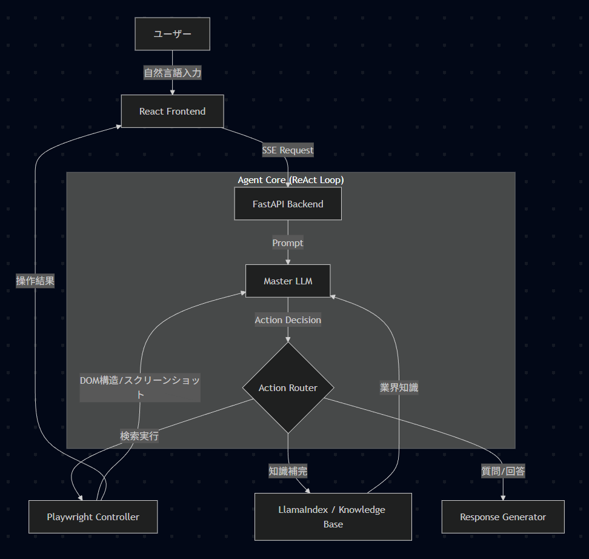

<div align="center">

[**🇯🇵 日本語 (Japanese)**](#jp) | [**🇺🇸 English**](#en)

</div>

---

<div id="jp"></div>

# 自然言語駆動型 B2Bターゲット検索 & CRM分析エージェント

## 概要
**「広東省のガラス工場を探して」** という外部検索の要望から、**「先月の上海での商談状況はどうだった？」** という社内データの問い合わせまで。

本プロジェクトは、営業担当者の自然言語入力を解析し、**外部Web検索（Playwright）** と **社内CRMデータベース（Text-to-SQL）** を使い分ける自律型AIエージェントです。また、非構造化データ（PDF/Excel/画像）を含む社内ナレッジベース（RAG）とも統合され、多角的な情報支援を行います。

単なるデモに留まらず、**エージェントの判断ロジックを定量的に評価するテストパイプライン**を実装し、実用性と信頼性を重視した設計となっています。

## 主な機能と特徴

### 1. ReAct型 自律エージェント (Agentic Decision Making)
ユーザーの意図を以下の3つのアクションに分類し、最適なツールを自律的に選択・実行します。
*   **Web Scraper**: Playwrightを用いた動的Webサイト（企業DB）のスクリーニング。
*   **Internal CRM Analyst**: 自然言語をSQLに変換し、社内データベースを分析。
*   **Knowledge Base (RAG)**: 業界レポートや過去の議事録など、非構造化データを検索。

### 2. Agentic Data QA (Text-to-SQL & Schema Awareness)
`database.py` および `backend_app.py` に実装された機能により、エージェントはDBスキーマを動的に理解します。
*   **Text-to-SQL**: 「売上10万以上の商談」のような自然言語を、適切な `JOIN` を含むSQLクエリに変換し実行します。
*   **Security**: 生成されたSQLは読み取り専用（READ ONLY）トランザクションで実行され、データの破壊を防ぎます。

### 3. マルチフォーマット対応 RAG (Azure AI Integration)
`rag_utils.py` では、Azure AI Document Intelligence と Pandas を組み合わせ、多様な社内ドキュメントをインデックス化しています。
*   **対応フォーマット**: PDF, Word, PowerPoint, 画像 (JPG/PNG) に加え、**Excel (.xlsx)** のMarkdown変換にも対応。
*   **ハイブリッド解析**: 画像化された図表はAzureのOCRで、構造化された表データはPandasで解析し、LLMが理解しやすい形式（Markdown）に変換して検索精度を向上させています。

### 4. エージェント評価システム (Quantitative Evaluation)
**「AIが正しくツールを選べているか？」** を定量的に測定するため、`run_agent_eval.py` による評価パイプラインを構築しました。
*   **シナリオベース評価**: 30件以上の想定シナリオ（`agent_react_scenarios.json`）に対し、エージェントの「思考（Thought）」と「行動（Action）」、および「抽出パラメータ」が期待値と一致するかを自動テストします。
*   **精度算出**: Actionの一致率やSQL生成に必要なキーワード含有率などを判定し、エージェントの改修前後でのリグレッションを防ぎます。

### 5. 高度なWeb操作 (LLM x Playwright)
Webページ全体ではなく、DOM構造を解析して「意味のある選択肢」のみを抽出・JSON化してLLMに渡すことで、トークン消費を抑えつつ複雑なフォーム操作（業界ツリーの展開など）を実現しています。

## 技術スタック

| カテゴリ | 技術・ツール | 用途 |
| --- | --- | --- |
| **Frontend** | React, SSE (Server-Sent Events) | チャットUI、ストリーミング表示 |
| **Backend** | Python, FastAPI | 非同期APIサーバー、エージェント制御 |
| **Database** | PostgreSQL, SQLAlchemy (Async) | CRMデータ管理、非同期クエリ実行 |
| **LLM / AI** | OpenAI SDK (ModelScope/Qwen), Gemini | 推論、SQL生成、JSON解析 |
| **RAG / ETL** | LlamaIndex, Azure Document Intelligence, Pandas | マルチモーダルドキュメント解析 |
| **Automation** | Playwright | ヘッドレスブラウザ操作 |
| **Evaluation** | Custom Eval Script (`run_agent_eval.py`) | エージェント判断ロジックの定量評価 |
| **Infra** | Docker, Docker Compose | DB環境の構築 |

## アーキテクチャ図



## 評価パイプラインについて

本プロジェクトでは、LLMアプリケーションの品質担保のため、開発プロセスに評価（Evaluation）を組み込んでいます。

*   **データセット**: `agent_react_scenarios.json`
    *   KB検索、Web検索提案、CRM分析、雑談など、多様なユーザーインテントを定義。
*   **評価スクリプト**: `run_agent_eval.py`
    *   エージェントを実行し、出力された JSON（Action, Params）と正解データを比較。
    *   パラメータの一致（許容範囲内の揺らぎを含む）や、SQLクエリの妥当性を検証。

**実行結果例:**
```text
[1/30] テスト実行中: case_crm_01
📝 概要: CRM查询：基础 (上海の商談中企業)
✅ PASS (2.14s)
   🎬 [Action] : search_internal_crm
   ⚙️ [SQL]    : SELECT c.name ... FROM companies c JOIN sales_records ...
```

## セットアップと実行

### 1. 環境構築

```powershell
# リポジトリのクローン
git clone [repo_url]
cd [repo_name]

# 仮想環境作成
python -m venv venv
.\venv\Scripts\Activate.ps1

# 依存関係インストール
pip install -r requirements.txt
playwright install
```

### 2. データベースの起動 (Docker)

CRMデータ分析機能を有効にするため、PostgreSQLコンテナを起動します。

```powershell
docker-compose up -d
```
*   `init_db.sql` により、企業・担当者・商談履歴のサンプルデータが自動的に投入されます。

### 3. Backend / Frontend の起動

**Backend:**
```powershell
# 環境変数の設定 (api_keys.json または .env)
uvicorn backend_app:app --reload
```

**Frontend:**
```powershell
cd frontend
npm install
npm run dev
```

### 4. 評価スクリプトの実行

エージェントのロジックを変更した際は、以下のコマンドでリグレッションテストを行います。
```powershell
python run_agent_eval.py
```

---

<div id="en"></div>

# Agentic B2B Search & CRM Analysis System

## Overview
**From "Find glass factories in Guangdong" to "How were our sales in Shanghai last month?"**

This project is an autonomous AI agent designed to bridge the gap between external market intelligence and internal business data. It interprets natural language requests from sales representatives and intelligently switches between **External Web Scraping (Playwright)** and **Internal CRM Database Analysis (Text-to-SQL)**. Additionally, it integrates with an internal Knowledge Base (RAG) capable of handling unstructured data like PDFs, Excel, and Images.

Going beyond a simple demo, this project features a **Quantitative Evaluation Pipeline** to test the agent's decision-making logic, ensuring reliability and accuracy in a business context.

## Key Features

### 1. ReAct Autonomous Agent (Agentic Decision Making)
The agent classifies user intent into three core actions and executes the appropriate tools autonomously:
*   **Web Scraper**: Screens corporate databases via Playwright automation.
*   **Internal CRM Analyst**: Converts natural language into SQL to query internal PostgreSQL databases.
*   **Knowledge Base (RAG)**: Retrieves unstructured data from industry reports and meeting notes.

### 2. Agentic Data QA (Text-to-SQL & Schema Awareness)
Implemented in `database.py` and `backend_app.py`, the agent dynamically understands the DB schema.
*   **Text-to-SQL**: Translates complex queries like "Deals with sales over 100k" into correct SQL queries with `JOIN` operations.
*   **Security**: All SQL queries are executed within `READ ONLY` transactions to prevent data alteration.

### 3. Multi-Format RAG (Azure AI Integration)
`rag_utils.py` leverages Azure AI Document Intelligence and Pandas to index diverse internal documents.
*   **Supported Formats**: PDF, Word, PowerPoint, Images (JPG/PNG), and specifically **Excel (.xlsx)** via Markdown conversion.
*   **Hybrid Parsing**: Uses Azure OCR for images/diagrams and Pandas for structured tables, converting everything into LLM-friendly Markdown for higher retrieval accuracy.

### 4. Agent Evaluation System (Quantitative Evaluation)
To answer **"Is the AI choosing the right tools?"**, I built an evaluation pipeline using `run_agent_eval.py`.
*   **Scenario-based Testing**: Validates the agent's "Thought", "Action", and "Extracted Params" against 30+ defined scenarios (`agent_react_scenarios.json`).
*   **Accuracy Metrics**: Checks action matching rates and keyword inclusion in generated SQL queries to prevent regressions during development.

### 5. Advanced Web Automation (LLM x Playwright)
Instead of processing raw HTML, the system parses the DOM structure to extract only "meaningful interactive elements" into JSON. This allows the LLM to handle complex UIs (like nested industry trees) efficiently while reducing token usage.

## Tech Stack

| Category | Technology/Tool | Usage |
| --- | --- | --- |
| **Frontend** | React, SSE | Chat UI, Real-time Streaming |
| **Backend** | Python, FastAPI | Async API Server, Agent Control |
| **Database** | PostgreSQL, SQLAlchemy (Async) | CRM Data, Async Query Execution |
| **LLM / AI** | OpenAI SDK (ModelScope/Qwen), Gemini | Inference, Text-to-SQL, JSON Parsing |
| **RAG / ETL** | LlamaIndex, Azure Doc Intel, Pandas | Multi-modal Document Parsing |
| **Automation** | Playwright | Headless Browser Automation |
| **Evaluation** | Custom Eval Script (`run_agent_eval.py`) | Quantitative Logic Testing |
| **Infra** | Docker, Docker Compose | Database Environment |

## Architecture Diagram


## Evaluation Pipeline

To ensure quality in LLM application development, an evaluation process is integrated.

*   **Dataset**: `agent_react_scenarios.json`
    *   Defines intents for KB search, Web search proposals, CRM analysis, and chit-chat.
*   **Script**: `run_agent_eval.py`
    *   Runs the agent against scenarios and compares the JSON output (Action, Params) with ground truth.
    *   Validates parameter extraction accuracy and SQL query validity.

**Example Output:**
```text
[1/30] Testing: case_crm_01
📝 Description: CRM Query: Basic (Deals in Shanghai)
✅ PASS (2.14s)
   🎬 [Action] : search_internal_crm
   ⚙️ [SQL]    : SELECT c.name ... FROM companies c JOIN sales_records ...
```

## Setup & Execution

### 1. Environment Setup

```powershell
# Clone Repo
git clone [repo_url]
cd [repo_name]

# Create Venv
python -m venv venv
.\venv\Scripts\Activate.ps1

# Install Dependencies
pip install -r requirements.txt
playwright install
```

### 2. Start Database (Docker)

Start the PostgreSQL container to enable CRM analysis features.

```powershell
docker-compose up -d
```
*   `init_db.sql` will automatically populate sample data for companies, contacts, and sales records.

### 3. Start Backend / Frontend

**Backend:**
```powershell
# Ensure API Keys are set
uvicorn backend_app:app --reload
```

**Frontend:**
```powershell
cd frontend
npm install
npm run dev
```

### 4. Run Evaluation

Run regression tests whenever agent logic is modified.
```powershell
python run_agent_eval.py
```